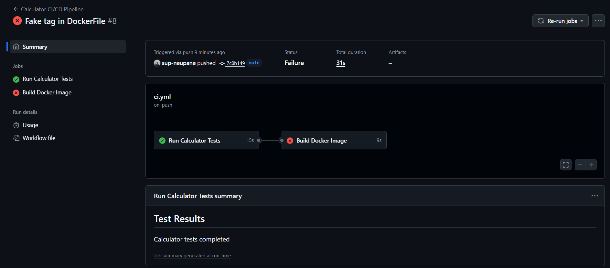
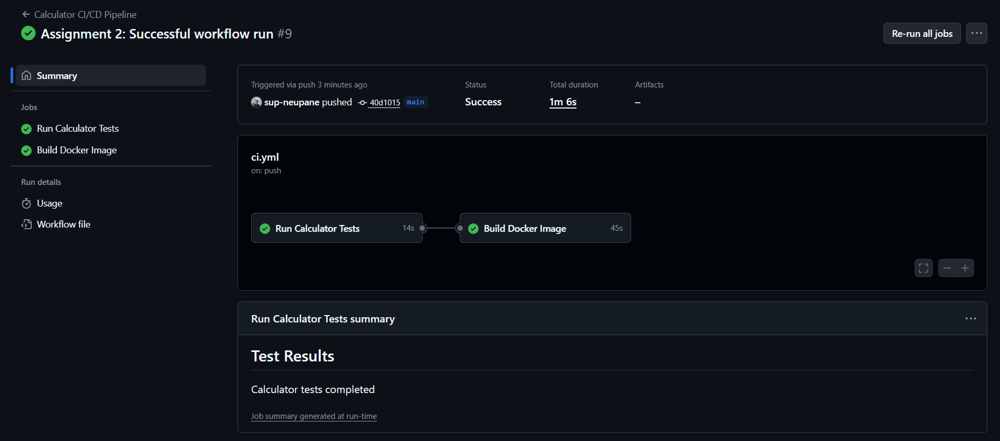

## Part A: Analyze the Working Pipeline

The pipeline from Assignment 1 works as follows:

- **Trigger**: The workflow is triggered on `push` and `pull_request` events targeting the `main` and `develop` branches.
- **Jobs**:
  1. **test-job**: Runs unit and integration tests.
     - Steps:
       - Checkout the repository
       - Setup Node.js environment
       - Install dependencies with `npm ci`
       - Run tests with `npm test`
       - Generate a test summary in GitHub Actions
  2. **build-job**: Builds and tests the Docker image. Depends on `test-job`.
     - Steps:
       - Checkout the repository
       - Setup Docker Buildx
       - Build Docker image
       - Run container tests (health endpoint and API endpoint)
       - Generate a build summary in GitHub Actions
- **`needs:` keyword**: This ensures `build-job` runs only if `test-job` completes successfully. It defines job dependencies in the workflow.

## Part B: The "Break and Fix" Challenge

### Step 1: Break It
Introduced a bug in the Dockerfile by using a non-existent base image:

FROM node:18-fake-tag

### Step 2: Push and Observe

Committed and pushed the broken Dockerfile. The pipeline failed during the build-job.

### Step 3: Analyze

Docker gave the following error:
Error: Process completed with exit code 1.

Explanation: Docker could not find the specified base image on Docker Hub, causing the build to fail.

### Step 4: Fix It

Corrected the Dockerfile:

FROM node:18

Committed and pushed the fix. The pipeline ran successfully, and the Docker image built correctly.

## Deliverables
- Document Workflow Links

Failed workflow run: https://github.com/sup-neupane/Hands-On-DevOps-CI-CD-LSPP-2025/actions/runs/18311259272/job/52140169894 

Successful workflow run: https://github.com/sup-neupane/Hands-On-DevOps-CI-CD-LSPP-2025/actions/runs/18311382810

- Screenshots

